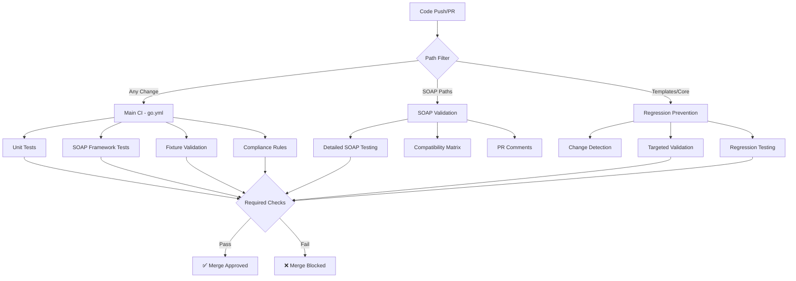

# GitHub Workflows - SOAP Request Validation CI Pipeline

This directory contains GitHub workflows that implement comprehensive SOAP request validation in the CI pipeline, preventing SOAP protocol violations and regressions.

## 🏗️ Workflow Overview

### Core Workflows

#### 1. `go.yml` - Main CI Pipeline
- **Purpose**: Primary CI workflow with integrated SOAP validation
- **Triggers**: Push to main/master, PRs
- **Key Features**:
  - Standard Go testing with coverage
  - **NEW**: SOAP request testing framework validation
  - **NEW**: Fixture-based SOAP tests
  - **NEW**: Compliance rule validation
  - Code coverage and reporting

#### 2. `soap-validation.yml` - Dedicated SOAP Validation
- **Purpose**: Comprehensive SOAP request validation with detailed reporting
- **Triggers**: Push/PR with paths: `pkg/generator/**`, `soap/**`, `test_fixtures/**`
- **Key Features**:
  - Fixture structure validation
  - SOAP request framework testing
  - Compliance rule validation with detailed reporting
  - SOAP compatibility matrix testing
  - Detailed PR comments with validation results

#### 3. `required-checks.yml` - Merge Gate
- **Purpose**: Required status checks that must pass before merge
- **Triggers**: All pushes and PRs
- **Key Features**:
  - Critical SOAP validation tests (merge blocking)
  - Known issue regression prevention
  - GitHub status check integration
  - Fast smoke tests for quick feedback

#### 4. `soap-regression-prevention.yml` - Smart Regression Prevention
- **Purpose**: Targeted validation when SOAP-sensitive code changes
- **Triggers**: Changes to templates, SOAP package, generator core
- **Key Features**:
  - Path-based change detection
  - Targeted validation based on what changed
  - Template change validation against all fixtures
  - SOAP package XML marshaling tests
  - Generator core change validation

### Auxiliary Workflows

#### 5. `license_go.yml` - License Validation
- **Purpose**: Ensures proper licensing headers
- **Status**: Existing workflow (unchanged)

#### 6. `release.yml` - Release Automation  
- **Purpose**: Automated releases
- **Status**: Existing workflow (unchanged)

## 🎯 SOAP Validation Integration

### What Gets Validated

1. **SOAP XML Generation**
   - Actual SOAP requests generated from WSDL files
   - RPC vs Document style binding compliance
   - Namespace handling (prevents `<tns:operation>` issues)

2. **Protocol Compliance**
   - SOAP envelope structure validation
   - Required elements checking
   - Namespace consistency validation

3. **Regression Prevention**
   - Tests against known issues (RPC namespace problem)
   - Template change impact validation
   - SOAP package marshaling regression testing

### Validation Rules Applied

- ✅ **RPC Operation Wrapper Rule** - Catches `<tns:operation>` vs `<operation xmlns="...">`
- ✅ **Document Style Rule** - Validates element-based messages
- ✅ **Namespace Consistency Rule** - Ensures prefix declarations
- ✅ **SOAP Envelope Rule** - Validates structure and namespaces  
- ✅ **Required Elements Rule** - Checks for empty bodies

## 🚨 Issue Prevention

This CI pipeline prevents:

- **RPC namespace issues** (the recent `<tns:information>` problem)
- **SOAP envelope malformation**
- **XML marshaling regressions**
- **Template rendering errors** that break SOAP generation
- **Generator logic breaks** affecting WSDL processing

## 📊 CI Pipeline Flow



## 🔧 Configuration

### Required Secrets
- `GITHUB_TOKEN` - For PR comments and status checks
- `CODECOV_TOKEN` - For code coverage reporting

### Branch Protection Rules

To fully leverage the SOAP validation, configure these required status checks:

1. **SOAP Request Validation** - From `required-checks.yml`
2. **Go Test** - From `go.yml`
3. **Go Lint** - From `go.yml`

### Path Filters

The workflows use intelligent path filtering:

```yaml
paths:
  - 'pkg/generator/**'    # Code generation changes
  - 'soap/**'             # SOAP package changes
  - 'test_fixtures/**'    # New fixtures
  - 'pkg/testing/**'      # Testing framework changes
```

## 📈 Workflow Outputs

### PR Comments
- **SOAP Validation Results** with fixture count and rule violations
- **Regression Prevention** with change detection and validation status
- **Detailed Reports** with actionable recommendations

### Artifacts
- `soap-validation-report` - Comprehensive validation results
- `soap-regression-report` - Regression prevention analysis
- `master.breakdown` - Coverage comparison data

### Status Checks
- **SOAP Request Validation** - Required for merge
- **Integration Smoke Test** - Quick validation
- Individual workflow status checks

## 🚀 Benefits

1. **Early Detection** - Catches SOAP issues before they reach production
2. **Regression Prevention** - Prevents known issues from reoccurring
3. **Detailed Feedback** - Clear error messages and suggestions
4. **Performance Optimization** - Only runs relevant tests based on changes
5. **Comprehensive Coverage** - Tests actual SOAP requests, not just Go code

## 🛠️ Local Development

Run the same validations locally:

```bash
# Basic SOAP validation
go test -v ./pkg/testing

# Integration tests
go test -v -tags=integration ./pkg/testing

# Specific validation rules
go test -v -tags=integration ./pkg/testing -run TestRuleEngineWithKnownIssues

# Fixture validation
go test -v ./pkg/testing -run TestSOAPRequestFixtures
```

## 📝 Adding New Validations

### Adding New Fixtures
1. Add WSDL files to `test_fixtures/{document_literal|rpc_literal}/`
2. Include expected request XML: `*_request.xml`
3. Add test data: `*_test_data.json`
4. Workflows will automatically pick up new fixtures

### Adding New Validation Rules
1. Add rules to `pkg/testing/validation_rules.go`
2. Implement the `ValidationRule` interface
3. Add to `NewRuleEngine()` in the rule engine
4. Workflows will automatically run new rules

### Workflow Customization
- Modify `soap-validation.yml` for additional reporting
- Update `required-checks.yml` for merge requirements  
- Adjust `soap-regression-prevention.yml` for new path filters

## 🔍 Troubleshooting

### Common Issues

**Tests fail with "No fixtures loaded"**
- Ensure fixtures exist in `test_fixtures/` directory
- Check file naming conventions match expected patterns

**Rule validation fails unexpectedly**
- Check if new code introduces SOAP compliance issues
- Review rule violation messages for specific guidance

**Path filters not triggering**  
- Verify file paths match the `paths:` configuration
- Check if changes are in monitored directories

### Debug Mode

Enable verbose output in workflows:
```yaml
- name: Debug SOAP Validation
  run: go test -v -tags=integration ./pkg/testing -run TestComprehensiveSOAPValidation
```

This CI pipeline ensures that the RPC namespace issue and similar SOAP protocol violations are caught immediately, preventing them from reaching production.